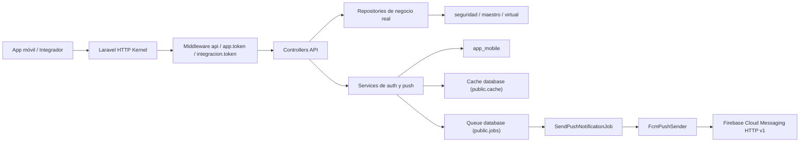
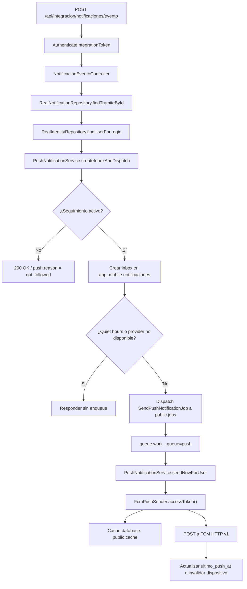

# api-not - Documento Vivo de Handover Backend

**Documento canónico**: este archivo es la referencia viva y única para arquitectura, contratos, operación y mantenimiento de `api-not`.

## Portada / encabezado

- **Proyecto**: `api-not`
- **Ruta del repo**: `C:\laragon\www\app-not\api-not`
- **Archivo canónico**: `docs/architecture/backend-final-handover.md`
- **Propósito del backend**: exponer la API móvil de NOT sobre Laravel, autenticando usuarios reales de la base `tramite`, resolviendo trámites/notificaciones sobre tablas reales y persistiendo estado móvil propio en `app_mobile`.
- **Fecha de última actualización**: `2026-03-27`
- **Estado general**: `operativo, estable y limpio fuera de hoja-ruta`
- **Pendiente funcional aceptado**: `GET /api/app/tramites/{id}/hoja-ruta` responde `501` hasta contar con una fuente real de movimientos.

> Si cambia arquitectura, contratos, tablas, variables, flujos o archivos relevantes, **se edita este mismo archivo**. No crear `v2`, `final-final`, `nuevo`, ni variantes paralelas.

## Cómo mantener este documento

- Actualizar el encabezado cada vez que cambie el estado general, la fecha de revisión o el pendiente aceptado.
- Si cambia un endpoint, editar a la vez las secciones **API y contratos**, **comunicación interna / dependencias** y, si aplica, `docs/contracts/*`.
- Si cambia una tabla, esquema o variable de entorno, editar a la vez **datos y BD**, **configuración y variables** y **operación / troubleshooting**.
- Si cambia la estructura de carpetas o archivos relevantes, editar a la vez **mapa de carpetas** e **inventario detallado**.
- Cuando un punto deje de aplicar, **corregirlo o eliminarlo en este mismo archivo**. No apilar notas contradictorias.
- El criterio de mantenimiento es simple: un desarrollador nuevo debe poder operar y mantener el backend leyendo solo este documento y los contratos específicos enlazados.

## Resumen ejecutivo

`api-not` es el backend móvil de NOT. Corre sobre Laravel 6, una sola BD PostgreSQL (`tramite`) y una capa de persistencia móvil propia en el esquema `app_mobile`. La aplicación resuelve identidad, permisos, entidades y trámites desde tablas reales (`seguridad`, `maestro`, `virtual`), y persiste tokens, seguimiento, inbox, configuración de notificaciones y dispositivos push en `app_mobile`.

### Módulos y estado actual

| Módulo | Estado | Observación |
| --- | --- | --- |
| Auth móvil (`login`, `logout`, `/me`) | Listo | Token propio en `app_mobile.usuario_tokens` |
| Entidades | Listo | `POST /api/app/entidades` público |
| Módulos | Listo | Sale de `config/mobile.php` |
| Trámites (`index`, `show`) | Listo | Fuente real `virtual.REMITO` |
| Seguimiento (`seguir`, `dejar seguir`) | Listo | Estado en `app_mobile.tramite_seguimientos` |
| Notificaciones inbox/resumen/leída | Listo | Inbox histórico |
| Configuración de notificaciones | Listo | Contrato v2, `America/Lima` fija |
| Dispositivos push | Listo | Tokens FCM en `app_mobile.usuario_dispositivos` |
| Integración `/api/integracion/notificaciones/evento` | Listo | Inbox-first + cola + FCM |
| Push / FCM / cola | Listo | `database queue` + `public.jobs` |
| Hoja de ruta | Pendiente aceptado | `501` controlado por falta de fuente real |

### Integraciones reales

- Base PostgreSQL `tramite`
- Esquemas de negocio: `seguridad`, `maestro`, `virtual`
- Persistencia móvil: `app_mobile`
- Infra Laravel: `public.cache`, `public.jobs`, `public.failed_jobs`
- Firebase Cloud Messaging HTTP v1
- Cola Laravel `database`

### Veredicto general

Fuera de `hoja-ruta`, el backend está cerrado para operación y mantenimiento. La superficie HTTP activa está consolidada en `routes/api.php`, la suite `tests/Feature` valida los contratos principales y el runtime real ya no depende de Passport, `usuarios_app` ni modos transicionales.

## Arquitectura general

### Stack exacto

- PHP `^7.2.5|^8.0` según `composer.json`
- Laravel `^6.20.26`
- PostgreSQL `tramite`
- Cache `database` sobre `public.cache`
- Queue `database` sobre `public.jobs` y `public.failed_jobs`
- Push FCM HTTP v1 con implementación propia
- Auth móvil propia con token hash SHA-256 en `app_mobile.usuario_tokens`

### Patrón arquitectónico real

El backend sigue un patrón Laravel limpio y explícito:

1. **Request HTTP** entra por `public/index.php`.
2. **Kernel HTTP** aplica middleware globales y de grupo.
3. **Route** resuelve controller y middleware específico.
4. **Controller** valida entrada y orquesta el caso de uso.
5. **Repository / Service** encapsula acceso a datos reales o lógica de negocio transversal.
6. **DB / Queue / Cache / FCM** ejecutan persistencia, integración o entrega.
7. **Response JSON** vuelve al cliente sin envelope `data`.

### Request -> middleware -> controller -> repository/service -> DB -> response

- Entrada HTTP: `public/index.php`
- Bootstrap: `bootstrap/app.php`
- Kernel: `app/Http/Kernel.php`
- Rutas API: `routes/api.php`
- Middleware custom: `AuthenticateAppToken`, `AuthenticateIntegrationToken`
- Controllers API: `app/Http/Controllers/Api/App/*` y `app/Http/Controllers/Api/Integracion/*`
- Repositories: `app/Repositories/*`
- Services: `app/Services/*`
- Models Eloquent: `app/Models/AppMobile/*`
- Response: JSON directo con `mensaje`, payloads o arrays según endpoint

### Auth móvil

- `POST /api/app/login` busca el usuario real con `RealIdentityRepository`.
- La contraseña se verifica con `Hash::check` contra `seguridad."USUARIO"."USU_CLAVE"`.
- `AccessTokenManager` emite un token aleatorio de 80 caracteres, almacena su hash SHA-256 y guarda contexto de usuario + empresa.
- `AuthenticateAppToken` resuelve el bearer token, renueva `expires_at` y expone `Request::user()` como `AuthenticatedAppUser`.
- La auth móvil **no** depende de `guards` estándar de Laravel; `config/auth.php` quedó solo como soporte framework.

### Integración

- `POST /api/integracion/notificaciones/evento` usa `AuthenticateIntegrationToken`.
- El controller de integración valida `tramiteId`, `evento` y `payload`.
- Se resuelve el trámite real y el usuario destinatario.
- `PushNotificationService` decide si crear inbox y/o despachar push.
- Regla oficial: si el trámite no está seguido, responde `200` con `reason = not_followed`, sin crear inbox ni push.

### Cache

- Store por defecto: `database`
- Tabla real: `public.cache`
- Usos actuales:
  - throttle de grupo `api`
  - cache del OAuth access token de FCM

### Queue

- Driver real: `database`
- Cola de push: `push`
- Tabla de jobs: `public.jobs`
- Tabla de fallos: `public.failed_jobs`
- Job real: `SendPushNotificationJob`

### Logs

- Canal efectivo: `config('mobile.log_channel')`
- Logs relevantes del flujo integración/push:
  - `integracion.evento_recibido`
  - `integracion.contexto_resuelto`
  - `integracion.tramite_no_encontrado`
  - `integracion.usuario_no_encontrado`
  - `push.not_followed`
  - `push.inbox_created`
  - `push.job_dispatched`
  - `push.job_started`
  - `push.dispatch_started`
  - `push.dispatch_finished`
  - `push.provider_not_configured`
  - `push.no_active_devices`
  - `push.queue_dispatch_failed`
  - `push.device_send_exception`

### Separación entre negocio real y persistencia móvil

- **Negocio real**:
  - `seguridad`: usuarios, empresas asociadas, permisos por sistema
  - `maestro`: catálogo de entidades/empresa
  - `virtual`: trámites y estados
- **Persistencia móvil propia**:
  - `app_mobile.usuario_tokens`
  - `app_mobile.tramite_seguimientos`
  - `app_mobile.usuario_notificacion_configuraciones`
  - `app_mobile.usuario_dispositivos`
  - `app_mobile.notificaciones`
- **Infraestructura Laravel**:
  - `public.cache`
  - `public.jobs`
  - `public.failed_jobs`

### Diagrama general de arquitectura



## Mapa de carpetas del repo

### Vista top-level

| Carpeta / archivo | Propósito | Naturaleza |
| --- | --- | --- |
| `app/` | Código fuente del backend | Runtime activo + soporte framework |
| `config/` | Configuración Laravel y configuración canónica móvil | Runtime activo + soporte framework |
| `database/` | Migraciones reales y seeding base | Runtime activo + soporte |
| `docs/contracts/` | Contratos específicos publicados | Documentación |
| `public/` | Front controller y soporte HTTP | Runtime activo + soporte |
| `bootstrap/` | Bootstrap Laravel | Soporte/framework |
| `routes/` | Superficie HTTP activa | Runtime activo |
| `tests/` | Suite feature y soporte de testing | Test |
| `resources/` | Traducciones framework restantes | Soporte/framework |
| `README.md` | Guía operativa breve | Documentación |
| `composer.json` | Dependencias y scripts Composer | Runtime/soporte |
| `phpunit.xml` | Configuración de tests | Test |
| `.env.example` | Plantilla canónica de entorno | Documentación / operación |

### Convención de clasificación usada en este documento

- **Runtime activo**: participa directamente del comportamiento actual del backend.
- **Soporte/framework**: archivo necesario o legítimo para bootstrap Laravel, pero no fuente principal de la lógica móvil.
- **Test**: cubre comportamiento o soporte de pruebas.
- **Documentación**: guía o contrato versionado.
- **Histórico**: se conserva para explicar la evolución o compatibilidad documental.

## Inventario detallado de archivos relevantes

### Raíz del repo

| Ruta | Función exacta | Módulo / uso | Tipo |
| --- | --- | --- | --- |
| `README.md` | Guía operativa corta del backend, variables mínimas, worker y smoke | Operación local | Documentación |
| `composer.json` | Declara dependencias, autoload y scripts Composer | Bootstrap del proyecto | Runtime activo / soporte |
| `composer.lock` | Fija versiones exactas de dependencias | Reproducibilidad | Soporte |
| `phpunit.xml` | Configura suite `Feature`, SQLite in-memory y queue `sync` para tests | Testing | Test |
| `.env.example` | Plantilla canónica del runtime real | Operación / onboarding | Documentación |
| `.env.testing` | Entorno específico de pruebas | Testing | Test |
| `artisan` | Entry point CLI Laravel | Framework | Soporte/framework |
| `server.php` | Soporte para `php artisan serve` / built-in server | Framework | Soporte/framework |
| `.editorconfig`, `.gitattributes`, `.gitignore`, `.styleci.yml` | Higiene de repo | Repositorio | Soporte |

### `app/`

#### `app/Console`

| Ruta | Función exacta | Módulo / uso | Tipo |
| --- | --- | --- | --- |
| `app/Console/Kernel.php` | Kernel de consola; hoy no agenda tareas ni registra comandos propios | Framework | Soporte/framework |

#### `app/Exceptions`

| Ruta | Función exacta | Módulo / uso | Tipo |
| --- | --- | --- | --- |
| `app/Exceptions/Handler.php` | Handler global de excepciones Laravel | Framework / errores | Soporte/framework |

#### `app/Http/Controllers`

##### Base

| Ruta | Función exacta | Módulo / uso | Tipo |
| --- | --- | --- | --- |
| `app/Http/Controllers/Controller.php` | Base controller Laravel | Framework | Soporte/framework |
| `app/Http/Controllers/Api/App/ApiController.php` | Helpers comunes `ok`, `error` y lectura de módulos/permisos | Base para controllers app | Runtime activo |

##### Controllers app móvil

| Ruta | Función exacta | Módulo soportado | Tipo |
| --- | --- | --- | --- |
| `app/Http/Controllers/Api/App/AutenticacionController.php` | `login`, `me`, `logout`; emite tokens y revoca sesión/dispositivo | Auth móvil | Runtime activo |
| `app/Http/Controllers/Api/App/EntidadController.php` | Expone `POST /api/app/entidades` | Entidades | Runtime activo |
| `app/Http/Controllers/Api/App/ModuloController.php` | Devuelve módulos visibles desde config | Módulos | Runtime activo |
| `app/Http/Controllers/Api/App/TramiteController.php` | Lista, detalle, seguir, dejar seguir y `hoja-ruta 501` | Trámites | Runtime activo |
| `app/Http/Controllers/Api/App/NotificacionController.php` | Inbox, resumen y marcar leída | Notificaciones | Runtime activo |
| `app/Http/Controllers/Api/App/NotificacionConfiguracionController.php` | Show/update de configuración v2 | Configuración de notificaciones | Runtime activo |
| `app/Http/Controllers/Api/App/DispositivoPushController.php` | Registra e invalida dispositivos FCM | Push dispositivos | Runtime activo |

##### Controller de integración

| Ruta | Función exacta | Módulo soportado | Tipo |
| --- | --- | --- | --- |
| `app/Http/Controllers/Api/Integracion/NotificacionEventoController.php` | Endpoint invokable de integración, valida payload, resuelve trámite/usuario y dispara inbox + push | Integración de eventos | Runtime activo |

#### `app/Http/Middleware`

| Ruta | Función exacta | Módulo / uso | Tipo |
| --- | --- | --- | --- |
| `app/Http/Middleware/AuthenticateAppToken.php` | Resuelve bearer token móvil y setea `Request::user()` | Auth móvil | Runtime activo |
| `app/Http/Middleware/AuthenticateIntegrationToken.php` | Valida token estático para integración | Integración | Runtime activo |
| `app/Http/Middleware/Authenticate.php` | Middleware auth estándar Laravel | Framework | Soporte/framework |
| `app/Http/Middleware/CheckForMaintenanceMode.php` | Modo mantenimiento | Framework | Soporte/framework |
| `app/Http/Middleware/EncryptCookies.php` | Cookies del grupo `web` | Framework | Soporte/framework |
| `app/Http/Middleware/RedirectIfAuthenticated.php` | Redirección auth framework | Framework | Soporte/framework |
| `app/Http/Middleware/TrimStrings.php` | Trim global de strings | Framework | Soporte/framework |
| `app/Http/Middleware/TrustProxies.php` | Reverse proxies | Framework | Soporte/framework |
| `app/Http/Middleware/VerifyCsrfToken.php` | CSRF del grupo `web` | Framework | Soporte/framework |

#### `app/Http/Requests/Api/App`

| Ruta | Función exacta | Módulo / uso | Tipo |
| --- | --- | --- | --- |
| `app/Http/Requests/Api/App/ApiRequest.php` | Base request con respuesta `422` y `403` homogénea | Base API app | Runtime activo |
| `app/Http/Requests/Api/App/LoginRequest.php` | Valida `username`, `password`, `codEmp` | Auth móvil | Runtime activo |
| `app/Http/Requests/Api/App/UpdateNotificacionConfiguracionRequest.php` | Valida contrato v2 y fija `America/Lima` | Configuración notificaciones | Runtime activo |
| `app/Http/Requests/Api/App/UpsertDispositivoPushRequest.php` | Valida alta/actualización de push token | Push dispositivos | Runtime activo |
| `app/Http/Requests/Api/App/InvalidateDispositivoPushRequest.php` | Valida invalidación por `deviceId` | Push dispositivos | Runtime activo |

#### `app/Jobs`

| Ruta | Función exacta | Módulo / uso | Tipo |
| --- | --- | --- | --- |
| `app/Jobs/SendPushNotificationJob.php` | Job `ShouldQueue` que rehidrata el usuario y ejecuta el envío real FCM | Push / cola | Runtime activo |

#### `app/Models/AppMobile`

| Ruta | Función exacta | Módulo soportado | Tipo |
| --- | --- | --- | --- |
| `app/Models/AppMobile/AppMobileModel.php` | Base model para tablas `app_mobile.*` en pgsql y `app_mobile_*` en SQLite | Persistencia móvil | Runtime activo |
| `app/Models/AppMobile/UsuarioToken.php` | Sesiones móviles, scope `valid()` y expiración | Auth móvil | Runtime activo |
| `app/Models/AppMobile/TramiteSeguimiento.php` | Persistencia de seguimiento activo/inactivo | Seguimiento | Runtime activo |
| `app/Models/AppMobile/UsuarioNotificacionConfiguracion.php` | Defaults y constante de zona fija | Configuración notificaciones | Runtime activo |
| `app/Models/AppMobile/UsuarioDispositivo.php` | Dispositivos FCM y scope `active()` | Push dispositivos | Runtime activo |
| `app/Models/AppMobile/Notificacion.php` | Inbox persistido del usuario | Notificaciones | Runtime activo |

#### `app/Providers`

| Ruta | Función exacta | Módulo / uso | Tipo |
| --- | --- | --- | --- |
| `app/Providers/AppServiceProvider.php` | Bindea `PushSender -> FcmPushSender` y carga migraciones de testing | Bootstrap de servicios | Runtime activo |
| `app/Providers/RouteServiceProvider.php` | Carga `routes/api.php` bajo prefijo `/api` | Routing | Runtime activo |
| `app/Providers/AuthServiceProvider.php` | Extension point estándar de policies | Framework | Soporte/framework |
| `app/Providers/EventServiceProvider.php` | Provider estándar de eventos | Framework | Soporte/framework |

#### `app/Repositories`

##### Identidad

| Ruta | Función exacta | Módulo soportado | Tipo |
| --- | --- | --- | --- |
| `app/Repositories/Identity/RealIdentityRepository.php` | Login real, usuario por token context, empresas activas, permisos y nombre visible | Auth / identidad / entidades | Runtime activo |

##### Trámites

| Ruta | Función exacta | Módulo soportado | Tipo |
| --- | --- | --- | --- |
| `app/Repositories/Tramites/RealTramiteRepository.php` | Lista y detalle de trámites visibles, seguimiento y conteo de no leídas por trámite | Trámites | Runtime activo |

##### Notificaciones

| Ruta | Función exacta | Módulo soportado | Tipo |
| --- | --- | --- | --- |
| `app/Repositories/Notifications/RealNotificationRepository.php` | Inbox histórico visible, resumen, `markRead`, creación de inbox, lookup de trámite y chequeo de seguimiento | Notificaciones / integración | Runtime activo |
| `app/Repositories/Notifications/RealNotificationSettingsRepository.php` | Lee y escribe configuración v2 | Configuración notificaciones | Runtime activo |
| `app/Repositories/Notifications/RealPushDeviceRepository.php` | Upsert, invalidate y touch de dispositivos push | Push dispositivos | Runtime activo |

#### `app/Services`

##### Auth

| Ruta | Función exacta | Módulo soportado | Tipo |
| --- | --- | --- | --- |
| `app/Services/Auth/AccessTokenManager.php` | Emite, resuelve, renueva y revoca tokens móviles | Auth móvil | Runtime activo |
| `app/Services/Auth/AuthenticatedAppUser.php` | DTO/autenticatable de usuario móvil con aliases camel/snake | Auth / identidad | Runtime activo |

##### Push

| Ruta | Función exacta | Módulo soportado | Tipo |
| --- | --- | --- | --- |
| `app/Services/Push/PushSender.php` | Contrato del provider de push | Push | Runtime activo |
| `app/Services/Push/FcmPushSender.php` | Implementación FCM HTTP v1, OAuth JWT, cache token y parseo de invalid token | Push / FCM | Runtime activo |
| `app/Services/Push/PushNotificationService.php` | Orquestación inbox-first, `not_followed`, quiet hours y dispatch a cola | Push / integración | Runtime activo |

### `config/`

| Ruta | Función exacta | Módulo / uso | Tipo |
| --- | --- | --- | --- |
| `config/app.php` | Config base, providers, aliases y timezone global `UTC` | Bootstrap | Soporte/framework |
| `config/auth.php` | Config auth framework mínima; no gobierna la auth móvil real | Framework | Soporte/framework |
| `config/cache.php` | Stores de cache, store `database`, tabla `cache` | Cache / throttle / FCM OAuth | Runtime activo |
| `config/database.php` | Conexiones DB, default `pgsql`, schema `public` | Base de datos | Runtime activo |
| `config/filesystems.php` | Discos de storage | Framework | Soporte/framework |
| `config/hashing.php` | Hashing usado por `Hash::check` | Auth móvil | Soporte activo |
| `config/logging.php` | Canales de log | Logs | Runtime activo |
| `config/mail.php` | Config de mail framework; no participa del runtime móvil actual | Framework | Soporte/framework |
| `config/mobile.php` | Config canónica del backend móvil: conexión, TTL, cola, módulos, permisos, log channel | Runtime móvil | Runtime activo |
| `config/queue.php` | Config `database queue`, `jobs` y `failed_jobs` | Cola | Runtime activo |
| `config/services.php` | Credencial integración y FCM | Integración / Push | Runtime activo |
| `config/session.php` | Config sesión framework; no gobierna la auth móvil | Framework | Soporte/framework |
| `config/view.php` | Config view framework; se conserva por `ViewServiceProvider` | Framework | Soporte/framework |

### `database/`

| Ruta | Función exacta | Módulo / uso | Tipo |
| --- | --- | --- | --- |
| `database/seeds/DatabaseSeeder.php` | Seeder base sin seeds de negocio real | Soporte | Soporte |
| `database/migrations/2026_03_24_090000_create_app_mobile_schema.php` | Crea esquema `app_mobile` | Persistencia móvil | Runtime activo |
| `database/migrations/2026_03_24_090100_create_app_mobile_tables.php` | Crea tablas móviles base | Persistencia móvil | Runtime activo |
| `database/migrations/2026_03_24_100200_add_empresa_codigo_to_app_mobile_usuario_tokens_table.php` | Agrega contexto de empresa a tokens | Auth móvil | Runtime activo |
| `database/migrations/2026_03_24_150500_create_app_mobile_cache_table.php` | Paso histórico: cache en `app_mobile` | Evolución de infraestructura | Histórico |
| `database/migrations/2026_03_25_090000_move_cache_table_to_public_schema.php` | Mueve `cache` a `public` | Infra cache | Runtime activo |
| `database/migrations/2026_03_27_090000_create_queue_tables.php` | Crea `jobs` y `failed_jobs` | Cola | Runtime activo |
| `database/migrations/2026_03_27_120000_backfill_app_mobile_usuario_tokens_expiration.php` | Backfill de expiración de tokens previos | Auth móvil | Runtime activo |

### `routes/`

| Ruta | Función exacta | Módulo / uso | Tipo |
| --- | --- | --- | --- |
| `routes/api.php` | Superficie HTTP productiva completa | API móvil + integración | Runtime activo |

### `tests/`

| Ruta | Función exacta | Módulo / uso | Tipo |
| --- | --- | --- | --- |
| `tests/CreatesApplication.php` | Bootstrap de app para tests | Testing | Test |
| `tests/TestCase.php` | Base test case | Testing | Test |
| `tests/Feature/App/Concerns/SeedsRealIdentityContext.php` | Seed helper para simular identidad real | Testing | Test |
| `tests/Feature/App/RealIdentityAuthFeatureTest.php` | Prueba login, `/me`, entidades, módulos y TTL rolling | Auth / identidad | Test |
| `tests/Feature/App/RealTramitesFeatureTest.php` | Prueba trámites, seguimiento y `hoja-ruta 501` | Trámites | Test |
| `tests/Feature/App/RealNotificacionesFeatureTest.php` | Prueba inbox histórico, resumen, marcar leída y configuración v2 | Notificaciones | Test |
| `tests/Feature/App/RealPushDispositivosFeatureTest.php` | Prueba upsert/invalidate de push token y logout con deviceId | Push dispositivos | Test |
| `tests/Feature/Integracion/RealNotificacionesEventoIntegracionFeatureTest.php` | Prueba integración, quiet hours, `not_followed`, queue dispatch e inbox-first | Integración / Push | Test |
| `tests/Support/Database/Migrations/2026_03_24_100000_create_testing_tramite_identity_tables.php` | Tablas SQLite de `seguridad` y `maestro` | Testing | Test support |
| `tests/Support/Database/Migrations/2026_03_24_110000_create_testing_tramite_virtual_tables.php` | Tablas SQLite de `virtual` | Testing | Test support |

### `docs/contracts/`

| Ruta | Función exacta | Módulo / uso | Tipo |
| --- | --- | --- | --- |
| `docs/contracts/app-api-v1.md` | Contrato consolidado principal de la app | App móvil | Documentación |
| `docs/contracts/app-me-v1.md` | Contrato específico de `/me` | Auth / perfil | Documentación |
| `docs/contracts/app-mvp-matrix-v1.md` | Matriz de endpoints y estado MVP | Estado funcional | Documentación |
| `docs/contracts/app-notificaciones-configuracion-v2.md` | Contrato v2 de configuración | Notificaciones | Documentación |
| `docs/contracts/app-push-notifications-v1.md` | Documento histórico/deprecado sobre push | Histórico documental | Histórico |
| `docs/contracts/integracion-notificaciones-evento-v1.md` | Contrato del endpoint de integración | Integración | Documentación |

### `public/`

| Ruta | Función exacta | Módulo / uso | Tipo |
| --- | --- | --- | --- |
| `public/index.php` | Front controller HTTP | Runtime web/API | Runtime activo |
| `public/web.config` | Soporte IIS / Laragon | Infra local | Soporte/framework |
| `public/robots.txt` | Archivo público básico | Soporte menor | Soporte |
| `public/favicon.ico` | Asset público básico | Soporte menor | Soporte |

### `bootstrap/`

| Ruta | Función exacta | Módulo / uso | Tipo |
| --- | --- | --- | --- |
| `bootstrap/app.php` | Crea la app Laravel y bindea kernels/handler | Bootstrap | Soporte/framework |
| `bootstrap/cache/.gitignore` | Mantiene el directorio de cache compilada versionable | Soporte | Soporte |

### `resources/`

| Ruta | Función exacta | Módulo / uso | Tipo |
| --- | --- | --- | --- |
| `resources/lang/en/auth.php` | Mensajes auth framework | Framework | Soporte/framework |
| `resources/lang/en/pagination.php` | Mensajes paginación | Framework | Soporte/framework |
| `resources/lang/en/passwords.php` | Mensajes password reset | Framework | Soporte/framework |
| `resources/lang/en/validation.php` | Mensajes validación | Framework | Soporte/framework |

## Datos y base de datos

### Conexión principal

- Conexión por defecto: `pgsql`
- Base única: `tramite`
- Schema por defecto de la conexión: `public`
- Archivo fuente de verdad: `config/database.php`

### Esquemas usados y función de cada uno

| Esquema | Qué aporta al backend |
| --- | --- |
| `seguridad` | Identidad real, pertenencia usuario-empresa, permisos por sistema |
| `maestro` | Entidades / empresas activas |
| `virtual` | Trámites reales y estados |
| `app_mobile` | Persistencia móvil propia del backend |
| `public` | Infraestructura Laravel: cache y cola |

### Tablas clave por esquema

#### `seguridad`

| Tabla | Uso principal | Columnas clave |
| --- | --- | --- |
| `seguridad."USUARIO"` | Identidad real y password hash | `ID`, `COD_USUARIO`, `USU_CLAVE`, `NOM_USUARIO`, `NOMBRES`, `DES_APELLP`, `DES_APELLM`, `IND_ESTADO` |
| `seguridad."USUARIO_EMPRESA"` | Pertenencia activa a empresa | `COD_USUARIO`, `COD_EMP`, `IND_ESTADO` |
| `seguridad."USUARIO_SISTEMA"` | Sistemas/permisos por empresa | `COD_USUARIO`, `COD_EMP`, `COD_SISTEMA`, `IND_ESTADO` |
| `seguridad."SISTEMA"` | Catálogo de sistemas | `COD_SISTEMA`, `IND_ESTADO` |

#### `maestro`

| Tabla | Uso principal | Columnas clave |
| --- | --- | --- |
| `maestro."EMPRESA"` | Catálogo de entidades activas | `COD_EMP`, `DES_EMP`, `IMAGEN`, `IND_ESTADO` |

#### `virtual`

| Tabla | Uso principal | Columnas clave |
| --- | --- | --- |
| `virtual."REMITO"` | Trámite real visible al usuario | `ID`, `COD_EMP`, `ADMINISTRADO_ID`, `ESTADO_ID`, `NUMERO_DOCUMENTO`, `NUMERO_EMISION`, `NRO_EXPEDIENTE`, `ASUNTO`, `OBSERVACION`, `FECHA_EMISION`, `FECHA`, `CREATED_AT`, `DELETED_AT` |
| `virtual."ESTADO"` | Estado actual del trámite | `ID`, `DESCRIPCION_USER`, `DESCRIPCION`, `DESCRIPCION_MP` |

#### `app_mobile`

| Tabla | Uso principal | Columnas clave |
| --- | --- | --- |
| `app_mobile.usuario_tokens` | Tokens móviles propios | `usuario_id`, `empresa_codigo`, `token`, `token_type`, `expires_at`, `last_used_at`, `revoked_at` |
| `app_mobile.tramite_seguimientos` | Seguimiento activo/inactivo por usuario y trámite | `usuario_id`, `tramite_id`, `activo` |
| `app_mobile.usuario_notificacion_configuraciones` | Configuración v2 de notificaciones | `usuario_id`, `silenciar_fuera_de_horario`, `hora_silencio_inicio`, `hora_silencio_fin`, `zona_horaria`, `mostrar_contador_no_leidas` |
| `app_mobile.usuario_dispositivos` | Dispositivos FCM registrados | `usuario_id`, `device_id`, `push_token`, `platform`, `activo`, `ultimo_registro_at`, `ultimo_push_at`, `invalidado_at` |
| `app_mobile.notificaciones` | Inbox histórico del usuario | `usuario_id`, `tramite_id`, `titulo`, `mensaje`, `tipo`, `leida`, `fecha_hora` |

#### `public`

| Tabla | Uso principal | Columnas clave |
| --- | --- | --- |
| `public.cache` | Cache runtime y access token OAuth FCM | `key`, `value`, `expiration` |
| `public.jobs` | Cola database | payload Laravel queue |
| `public.failed_jobs` | Fallos de cola | payload + exception |

### Relaciones funcionales clave

- **Token móvil -> usuario real**: `app_mobile.usuario_tokens.usuario_id` apunta lógicamente a `seguridad."USUARIO"."ID"`.
- **Token móvil -> empresa en contexto**: `app_mobile.usuario_tokens.empresa_codigo` define la empresa vigente para todas las queries autenticadas.
- **Usuario visible -> empresa**: `seguridad."USUARIO" + seguridad."USUARIO_EMPRESA" + maestro."EMPRESA"`, todas activas.
- **Permisos**: `seguridad."USUARIO_SISTEMA" + seguridad."SISTEMA"`, mapeados a ids de app desde `config/mobile.php`.
- **Trámite visible**: `virtual."REMITO"` visible si `DELETED_AT is null`, `ADMINISTRADO_ID == COD_USUARIO` y `COD_EMP == empresa_codigo` del token.
- **Seguimiento**: `app_mobile.tramite_seguimientos` controla solo la emisión futura de notificaciones.
- **Inbox visible**: `app_mobile.notificaciones` pertenece al usuario y sigue visible mientras el trámite siga siendo visible para su contexto.
- **Dispositivos**: `app_mobile.usuario_dispositivos` se resuelven por `usuario_id` y `activo = true`.

### Reglas de visibilidad, seguimiento e inbox

#### Visibilidad de trámites

- Un trámite solo aparece si pertenece al `COD_USUARIO` autenticado y a la `empresa_codigo` del token.
- Los trámites con `DELETED_AT` no se muestran.
- El detalle usa la misma regla que el listado.

#### Seguimiento

- `POST /api/app/tramites/{id}/seguir` crea o reactiva `tramite_seguimientos.activo = true`.
- `DELETE /api/app/tramites/{id}/seguir` deja `activo = false`.
- El seguimiento **no borra** notificaciones históricas ya creadas.
- El seguimiento **sí controla** si se crean nuevas notificaciones futuras.

#### Inbox histórico

- El inbox visible se basa en `app_mobile.notificaciones`.
- Una notificación ya creada sigue visible aunque el trámite después deje de seguirse.
- Para seguir visible, el trámite aún debe pertenecer al usuario y a la empresa del contexto.
- El inbox se ordena: no leídas primero, luego fecha/hora desc, luego id desc.

#### Expiración y renovación de tokens

- TTL actual: `30 días` desde `config('mobile.token_ttl_days')`.
- Al emitir token: `expires_at = now() + 30 días`.
- Cada request autenticado válido renueva `expires_at` otros 30 días desde el último uso.
- `UsuarioToken::valid()` exige `revoked_at is null` y `expires_at > now()`.

### Restricción estructural importante

No existen foreign keys entre `seguridad`, `maestro`, `virtual` y `app_mobile`. La integridad entre negocio real y persistencia móvil se valida en código. Esto es deliberado y debe tenerse presente al tocar queries, migraciones o procesos de limpieza.

## API y contratos

### Superficie productiva actual

| Método | Ruta | Auth | Middleware | Controller |
| --- | --- | --- | --- | --- |
| `POST` | `/api/app/entidades` | No | `api` | `EntidadController@index` |
| `POST` | `/api/app/login` | No | `api` | `AutenticacionController@login` |
| `POST` | `/api/app/logout` | Sí | `api,app.token` | `AutenticacionController@logout` |
| `GET` | `/api/app/me` | Sí | `api,app.token` | `AutenticacionController@me` |
| `GET` | `/api/app/modulos` | Sí | `api,app.token` | `ModuloController@index` |
| `GET` | `/api/app/tramites` | Sí | `api,app.token` | `TramiteController@index` |
| `GET` | `/api/app/tramites/{id}` | Sí | `api,app.token` | `TramiteController@show` |
| `GET` | `/api/app/tramites/{id}/hoja-ruta` | Sí | `api,app.token` | `TramiteController@hojaRuta` |
| `POST` | `/api/app/tramites/{id}/seguir` | Sí | `api,app.token` | `TramiteController@seguir` |
| `DELETE` | `/api/app/tramites/{id}/seguir` | Sí | `api,app.token` | `TramiteController@dejarSeguir` |
| `GET` | `/api/app/notificaciones` | Sí | `api,app.token` | `NotificacionController@index` |
| `GET` | `/api/app/notificaciones/resumen` | Sí | `api,app.token` | `NotificacionController@resumen` |
| `PATCH` | `/api/app/notificaciones/{id}/leida` | Sí | `api,app.token` | `NotificacionController@marcarLeida` |
| `GET` | `/api/app/notificaciones/configuracion` | Sí | `api,app.token` | `NotificacionConfiguracionController@show` |
| `PUT` | `/api/app/notificaciones/configuracion` | Sí | `api,app.token` | `NotificacionConfiguracionController@update` |
| `PUT` | `/api/app/dispositivos/push-token` | Sí | `api,app.token` | `DispositivoPushController@upsert` |
| `DELETE` | `/api/app/dispositivos/push-token` | Sí | `api,app.token` | `DispositivoPushController@invalidate` |
| `POST` | `/api/integracion/notificaciones/evento` | Sí, token integración | `api,integracion.token` | `NotificacionEventoController@__invoke` |

### Convenciones de respuesta y error

- Éxito: JSON directo, sin envelope `data`.
- Error de dominio: `{"mensaje":"..."}`.
- Error de validación: `{"mensaje":"Datos inválidos.","errores":{...}}`.
- Auth móvil inválida: `401 {"mensaje":"No autenticado."}`.
- Auth integración inválida: `401 {"mensaje":"No autorizado."}`.
- Integración sin token configurado: `503 {"mensaje":"Integración no configurada."}`.

### Contratos detallados

#### `POST /api/app/entidades`

- Auth: no.
- Middleware: `api`.
- Request esperado: sin body obligatorio.
- Response esperada: array de entidades activas con `codigo`, `id`, `nombre`, `imagen`.
- Errores esperados: `405` si se usa método distinto.
- Regla importante: es público y no requiere login.

#### `POST /api/app/login`

- Auth: no.
- Middleware: `api`.
- Request esperado:

```json
{
  "username": "20131257750",
  "password": "secreto",
  "codEmp": "0002"
}
```

- Response esperada:

```json
{
  "accessToken": "<token>",
  "tokenType": "Bearer"
}
```

- Errores esperados:
  - `401 {"mensaje":"Credenciales inválidas."}`
  - `422` por payload inválido
- Reglas importantes:
  - autentica contra tablas reales de `seguridad`
  - no devuelve perfil, solo token
  - el TTL inicial es de 30 días

#### `POST /api/app/logout`

- Auth: sí.
- Middleware: `api,app.token`.
- Request esperado: opcionalmente `deviceId` o `device_id`.
- Response esperada:

```json
{
  "mensaje": "Sesión cerrada correctamente."
}
```

- Errores esperados: `401 {"mensaje":"No autenticado."}`.
- Reglas importantes:
  - revoca el token actual
  - si se informa `deviceId`, invalida el dispositivo en `usuario_dispositivos`

#### `GET /api/app/me`

- Auth: sí.
- Middleware: `api,app.token`.
- Response esperada:

```json
{
  "username": "20131257750",
  "fullName": "Nombres ApellidoPaterno ApellidoMaterno",
  "empresa": {
    "codigo": "0002",
    "id": "0002",
    "nombre": "Gobierno Regional del Callao",
    "imagen": "logo.png"
  },
  "permisos": ["mesa_partes_virtual", "notificaciones"],
  "session": {
    "authenticated": true,
    "tokenType": "Bearer"
  }
}
```

- Regla importante: es la fuente de verdad del usuario autenticado.
- Regla de nombre visible: `NOMBRES + DES_APELLP + DES_APELLM`; si no existe contenido, fallback a `NOM_USUARIO`.

#### `GET /api/app/modulos`

- Auth: sí.
- Middleware: `api,app.token`.
- Response esperada: array definido en `config/mobile.php`.
- Regla importante: no sale de BD; sale de configuración canónica del backend.

#### `GET /api/app/tramites`

- Auth: sí.
- Middleware: `api,app.token`.
- Response esperada: array con `id`, `codigo`, `titulo`, `descripcion`, `fecha`, `estadoActual`, `siguiendo`, `notificacionesNoLeidas`.
- Errores esperados: `401` por auth inválida.
- Reglas importantes:
  - visibilidad por `ADMINISTRADO_ID + COD_EMP`
  - orden por fecha de referencia desc e id desc
  - si `siguiendo = false`, el controller fuerza `notificacionesNoLeidas = 0`

#### `GET /api/app/tramites/{id}`

- Auth: sí.
- Middleware: `api,app.token`.
- Response esperada: mismo payload base del listado más detalle completo del trámite.
- Errores esperados: `404 {"mensaje":"Trámite no encontrado."}`.
- Regla importante: solo devuelve trámites visibles para el usuario/empresa autenticados.

#### `POST /api/app/tramites/{id}/seguir`

- Auth: sí.
- Middleware: `api,app.token`.
- Response esperada:

```json
{
  "mensaje": "Trámite marcado para seguimiento."
}
```

- Errores esperados: `404` si el trámite no es visible.
- Regla importante: crea o reactiva el seguimiento.

#### `DELETE /api/app/tramites/{id}/seguir`

- Auth: sí.
- Middleware: `api,app.token`.
- Response esperada:

```json
{
  "mensaje": "Seguimiento eliminado."
}
```

- Errores esperados: `404` si el trámite no es visible.
- Regla importante: solo deja `activo = false`; no borra historial.

#### `GET /api/app/tramites/{id}/hoja-ruta`

- Auth: sí.
- Middleware: `api,app.token`.
- Si el trámite no existe/no es visible: `404`.
- Si existe: `501 {"mensaje":"Hoja de ruta no disponible mientras no exista una fuente real de movimientos."}`.
- Regla importante: esta es la única deuda funcional aceptada del backend.

#### `GET /api/app/notificaciones`

- Auth: sí.
- Middleware: `api,app.token`.
- Response esperada: array con `id`, `tramiteId`, `codigoTramite`, `titulo`, `mensaje`, `tipo`, `leida`, `fechaHora`.
- Regla importante: inbox histórico; no depende del seguimiento actual para seguir visible.

#### `GET /api/app/notificaciones/resumen`

- Auth: sí.
- Middleware: `api,app.token`.
- Response esperada:

```json
{
  "noLeidas": 3
}
```

- Regla importante: cuenta solo notificaciones visibles y no leídas.

#### `PATCH /api/app/notificaciones/{id}/leida`

- Auth: sí.
- Middleware: `api,app.token`.
- Response esperada:

```json
{
  "mensaje": "Notificación marcada como leída."
}
```

- Errores esperados: `404 {"mensaje":"Notificación no encontrada."}`.
- Regla importante: solo marca si la notificación pertenece al usuario y sigue visible.

#### `GET /api/app/notificaciones/configuracion`

- Auth: sí.
- Middleware: `api,app.token`.
- Response esperada: payload v2 en snake_case.
- Regla importante: `zona_horaria` siempre `America/Lima`.

#### `PUT /api/app/notificaciones/configuracion`

- Auth: sí.
- Middleware: `api,app.token`.
- Request esperado:

```json
{
  "silenciar_fuera_de_horario": true,
  "hora_silencio_inicio": "21:00",
  "hora_silencio_fin": "06:00",
  "zona_horaria": "Europe/Madrid",
  "mostrar_contador_no_leidas": false
}
```

- Response esperada: mismo payload normalizado con `zona_horaria = America/Lima`.
- Errores esperados: `422` por formato inválido.
- Regla importante: la ventana de silencio se interpreta siempre en `America/Lima`.

#### `PUT /api/app/dispositivos/push-token`

- Auth: sí.
- Middleware: `api,app.token`.
- Request esperado: `deviceId`, `pushToken`, `platform`; opcionales `deviceName`, `appVersion`.
- Acepta aliases snake_case de entrada.
- Response esperada: `mensaje` + `dispositivo` canonical en camelCase.
- Errores esperados: `422` por payload inválido.

#### `DELETE /api/app/dispositivos/push-token`

- Auth: sí.
- Middleware: `api,app.token`.
- Request esperado: `deviceId`.
- Response esperada:

```json
{
  "mensaje": "Token push invalidado correctamente."
}
```

#### `POST /api/integracion/notificaciones/evento`

- Auth: sí, token de integración.
- Middleware: `api,integracion.token`.
- Request esperado:

```json
{
  "tramiteId": 9901,
  "evento": "tramite_derivado",
  "payload": {
    "destino": "Gerencia General"
  }
}
```

- Eventos soportados:
  - `tramite_registrado`
  - `tramite_derivado`
  - `cambio_estado`
  - `movimiento_hoja_ruta`
- Response esperada con seguimiento activo:
  - `mensaje`
  - `notificacion` con payload del inbox creado
  - `push` con `reason = queued`
- Response esperada sin seguimiento activo:
  - `mensaje`
  - `notificacion = null`
  - `push.reason = not_followed`
- Errores esperados:
  - `401 {"mensaje":"No autorizado."}`
  - `422 {"mensaje":"Datos inválidos."}`
  - `404 {"mensaje":"Trámite no encontrado."}`
  - `503 {"mensaje":"Integración no configurada."}`
- Reglas importantes:
  - inbox histórico: una notificación ya creada no desaparece si luego se deja de seguir
  - emisión futura: si no hay seguimiento activo, no se crea inbox ni push
  - push usa patrón inbox-first

## Push / Firebase / cola

### Archivos que intervienen en el flujo de push

| Archivo | Rol exacto |
| --- | --- |
| `app/Http/Controllers/Api/Integracion/NotificacionEventoController.php` | Recibe el evento de integración, valida input, resuelve trámite/usuario y dispara el flujo |
| `app/Services/Push/PushNotificationService.php` | Aplica reglas de negocio: `not_followed`, inbox-first, quiet hours y dispatch a cola |
| `app/Jobs/SendPushNotificationJob.php` | Ejecuta el envío real en background |
| `app/Services/Push/FcmPushSender.php` | Implementa el provider FCM HTTP v1 |
| `app/Services/Push/PushSender.php` | Contrato abstracto del provider |
| `app/Repositories/Notifications/RealNotificationRepository.php` | Crea inbox, arma payload y resuelve contador no leído |
| `app/Repositories/Notifications/RealNotificationSettingsRepository.php` | Obtiene configuración de quiet hours |
| `app/Repositories/Notifications/RealPushDeviceRepository.php` | Obtiene dispositivos activos, invalida tokens y actualiza `ultimo_push_at` |
| `config/services.php` | Credenciales FCM e integración |
| `config/mobile.php` | Cola `push` y canal de log móvil |
| `config/queue.php` | Driver `database`, tablas `jobs` y `failed_jobs` |
| `config/cache.php` | Store `database` usado para cachear OAuth token FCM |

### Credenciales FCM

El runtime FCM se gobierna desde `config/services.php` y estas variables:

- `FCM_ENABLED`
- `FCM_PROJECT_ID`
- `FCM_SERVICE_ACCOUNT_JSON`
- `FCM_SERVICE_ACCOUNT_JSON_PATH`
- `FCM_OAUTH_TOKEN_URL`
- `FCM_SEND_URL`

Orden de resolución de credenciales:

1. `FCM_SERVICE_ACCOUNT_JSON` inline.
2. `FCM_SERVICE_ACCOUNT_JSON_PATH` como path literal.
3. `base_path(FCM_SERVICE_ACCOUNT_JSON_PATH)`.

Si no hay credenciales válidas, `FcmPushSender::isConfigured()` devuelve `false` y el sistema responde `provider_not_configured` sin lanzar push real.

### Generación del OAuth token

`FcmPushSender` implementa manualmente el flujo OAuth de service account:

1. Construye un JWT firmado `RS256` con `openssl_sign`.
2. Usa el scope `https://www.googleapis.com/auth/firebase.messaging`.
3. Hace POST a `FCM_OAUTH_TOKEN_URL`.
4. Extrae `access_token` y `expires_in`.
5. Cachea el token con una key basada en `sha1(project_id)`.

### Dónde se cachea el OAuth token

- Store efectivo: `CACHE_DRIVER=database`
- Tabla efectiva: `public.cache`
- Key: `services.fcm.access_token.<sha1(project_id)>`

### Cola y tablas de infraestructura

- Driver real: `database`
- Cola usada para push: `push`
- Tabla `public.jobs`: jobs pendientes de procesar
- Tabla `public.failed_jobs`: jobs fallidos con su exception/payload

### Worker requerido

```powershell
php artisan queue:work --queue=push --tries=3
```

Si el worker no corre:

- el inbox se crea igual
- la integración responde `queued`
- el push no sale hasta que el worker procese `public.jobs`

### Flujo exacto de integración -> inbox -> cola -> FCM

1. Llega `POST /api/integracion/notificaciones/evento`.
2. `AuthenticateIntegrationToken` valida el token.
3. `NotificacionEventoController` valida `tramiteId`, `evento`, `payload`.
4. `RealNotificationRepository::findTramiteById()` busca el trámite real.
5. `RealIdentityRepository::findUserForLogin()` resuelve al destinatario desde `administradoId + empresaCodigo`.
6. `PushNotificationService::createInboxAndDispatch()` decide el caso:
   - si no hay seguimiento activo -> `not_followed`, sin inbox ni push
   - si hay seguimiento activo -> crea inbox y evalúa dispatch
7. Si hay quiet hours activas -> deja inbox, no encola push y responde con razón de supresión.
8. Si FCM está configurado y hay dispositivos activos -> despacha `SendPushNotificationJob` a la cola `push`.
9. El worker toma el job y rehidrata el usuario real.
10. `PushNotificationService::sendNowForUser()` arma el mensaje con badge `noLeidas`.
11. `FcmPushSender::send()` obtiene/cacha OAuth token y hace POST a FCM HTTP v1.
12. Si FCM indica token inválido, el dispositivo se invalida en `app_mobile.usuario_dispositivos`.
13. Si el envío fue exitoso, se actualiza `ultimo_push_at`.

### Payload del mensaje push

- `notification.title` = título del inbox
- `notification.body` = mensaje del inbox
- `data.notificationId`
- `data.tramiteId`
- `data.codigoTramite`
- `data.tipo`
- `data.targetScreen = notificaciones`
- `data.noLeidas`
- `android.notification.notification_count = noLeidas`
- APNS con `sound = default`

### Logs emitidos por el flujo

| Evento de log | Momento |
| --- | --- |
| `integracion.evento_recibido` | Al recibir el request de integración |
| `integracion.contexto_resuelto` | Cuando trámite y usuario fueron resueltos |
| `integracion.tramite_no_encontrado` | Si no existe trámite válido |
| `integracion.usuario_no_encontrado` | Si no se puede resolver el administrado |
| `push.not_followed` | Si el trámite no tiene seguimiento activo |
| `push.inbox_created` | Después de crear inbox |
| `push.job_dispatched` | Cuando se encola el job |
| `push.job_started` | Cuando el worker comienza a procesar el job |
| `push.dispatch_started` | Antes de iterar dispositivos |
| `push.dispatch_finished` | Al finalizar el intento de envío |
| `push.provider_not_configured` | Si FCM no está configurado |
| `push.no_active_devices` | Si no hay dispositivos activos |
| `push.queue_dispatch_failed` | Si falló el enqueue |
| `push.device_send_exception` | Si un intento de envío por dispositivo lanza excepción |
| `push.user_context_not_found` | Si el job ya no puede rehidratar el usuario |

### Diagrama Mermaid del flujo integración -> inbox -> cola -> FCM



## Configuración y variables

### Archivos config que mandan realmente

| Archivo | Qué gobierna |
| --- | --- |
| `config/mobile.php` | Conexión móvil, TTL, cola push, módulos, permisos y canal de logs |
| `config/services.php` | Token de integración y credenciales FCM |
| `config/database.php` | Conexión a `tramite` |
| `config/cache.php` | Store `database` y tabla `cache` |
| `config/queue.php` | Driver de cola y tablas `jobs` / `failed_jobs` |
| `config/logging.php` | Canales de log |
| `config/hashing.php` | Verificación de password hash |
| `config/auth.php` | Soporte framework, no auth móvil |
| `config/view.php` | Soporte framework de vistas/excepciones |

### Variables `.env` críticas

| Variable | Impacto |
| --- | --- |
| `APP_NAME`, `APP_ENV`, `APP_KEY`, `APP_DEBUG`, `APP_URL` | Bootstrap general |
| `LOG_CHANNEL` | Canal base de logging |
| `DB_CONNECTION`, `DB_HOST`, `DB_PORT`, `DB_DATABASE`, `DB_USERNAME`, `DB_PASSWORD` | Toda la lectura/escritura real |
| `CACHE_DRIVER`, `CACHE_CONNECTION`, `CACHE_TABLE` | Throttle, cache runtime y OAuth FCM |
| `QUEUE_CONNECTION` | Dispatch asíncrono de push |
| `MOBILE_PUSH_QUEUE` | Nombre de la cola push |
| `MOBILE_LOG_CHANNEL` | Canal usado por logs funcionales |
| `MOBILE_TOKEN_TTL_DAYS` | Expiración rolling de tokens móviles |
| `INTEGRACION_API_TOKEN` | Habilita y autentica integración |
| `FCM_ENABLED`, `FCM_PROJECT_ID`, `FCM_SERVICE_ACCOUNT_JSON`, `FCM_SERVICE_ACCOUNT_JSON_PATH`, `FCM_OAUTH_TOKEN_URL`, `FCM_SEND_URL` | Push FCM |

### Qué impacta cada flujo

- **Auth móvil**: `DB_*`, `MOBILE_TOKEN_TTL_DAYS`, `config/mobile.php`, `config/hashing.php`
- **Integración**: `INTEGRACION_API_TOKEN`, `config/services.php`
- **Cache / throttle**: `CACHE_*`, `config/cache.php`, `app/Http/Kernel.php`
- **Queue**: `QUEUE_CONNECTION`, `MOBILE_PUSH_QUEUE`, `config/queue.php`
- **Push / FCM**: `FCM_*`, `MOBILE_LOG_CHANNEL`, `config/services.php`, `config/mobile.php`

### Política de expiración de tokens

- Tipo: `Bearer`
- TTL: `30 días` por defecto
- Renovación: rolling en cada request autenticado válido
- Revocación: explícita al hacer logout o al invalidar el token actual
- Fuente de verdad: `AccessTokenManager` + `UsuarioToken`

### Ejemplo mínimo de operación local

```env
APP_NAME="api-not"
APP_ENV=local
APP_KEY=
APP_DEBUG=true
APP_URL=http://127.0.0.1:8000

DB_CONNECTION=pgsql
DB_HOST=127.0.0.1
DB_PORT=5432
DB_DATABASE=tramite
DB_USERNAME=postgres
DB_PASSWORD=

CACHE_DRIVER=database
CACHE_CONNECTION=pgsql
CACHE_TABLE=cache
QUEUE_CONNECTION=database

MOBILE_PUSH_QUEUE=push
MOBILE_LOG_CHANNEL=stack
MOBILE_TOKEN_TTL_DAYS=30

FCM_ENABLED=false
FCM_PROJECT_ID=
FCM_SERVICE_ACCOUNT_JSON_PATH=
INTEGRACION_API_TOKEN=
```

## Comunicación interna y dependencias

### Controllers -> repositories / services

| Controller | Dependencias directas | Fuente de verdad del flujo |
| --- | --- | --- |
| `AutenticacionController` | `LoginRequest`, `RealIdentityRepository`, `AccessTokenManager`, `RealPushDeviceRepository` | Auth móvil |
| `EntidadController` | `RealIdentityRepository` | Entidades activas |
| `ModuloController` | `ApiController`, `config/mobile.php` | Catálogo de módulos |
| `TramiteController` | `RealTramiteRepository` | Trámites visibles y seguimiento |
| `NotificacionController` | `RealNotificationRepository` | Inbox histórico |
| `NotificacionConfiguracionController` | `UpdateNotificacionConfiguracionRequest`, `RealNotificationSettingsRepository` | Configuración v2 |
| `DispositivoPushController` | `UpsertDispositivoPushRequest`, `InvalidateDispositivoPushRequest`, `RealPushDeviceRepository` | Dispositivos push |
| `NotificacionEventoController` | `RealIdentityRepository`, `RealNotificationRepository`, `PushNotificationService` | Integración evento -> inbox/push |

### Services -> repositories / models / config

| Service / Job | Dependencias directas | Qué usa |
| --- | --- | --- |
| `AccessTokenManager` | `UsuarioToken`, `RealIdentityRepository`, `config/mobile.php` | Emisión y resolución de tokens |
| `PushNotificationService` | `PushSender`, `RealNotificationRepository`, `RealNotificationSettingsRepository`, `RealPushDeviceRepository`, `config/mobile.php` | Reglas de push e inbox |
| `FcmPushSender` | `Cache`, `config/services.php`, `config/cache.php` | OAuth y envío FCM |
| `SendPushNotificationJob` | `RealIdentityRepository`, `PushNotificationService` | Ejecución asíncrona de push |

### Qué usa `app_mobile`

- Auth móvil -> `usuario_tokens`
- Seguimiento -> `tramite_seguimientos`
- Configuración -> `usuario_notificacion_configuraciones`
- Dispositivos -> `usuario_dispositivos`
- Inbox -> `notificaciones`

### Qué usa negocio real

- Login y `/me` -> `seguridad` + `maestro`
- Entidades -> `maestro`
- Permisos -> `seguridad`
- Trámites -> `virtual`
- Integración -> `virtual` para trámite + `seguridad` para usuario destino

### Fuente de verdad por flujo

| Flujo | Fuente de verdad |
| --- | --- |
| Usuario autenticado | `AuthenticateAppToken` + `AccessTokenManager` + `RealIdentityRepository` |
| Nombre visible | `RealIdentityRepository::buildFullName()` |
| Módulos y permisos funcionales | `config/mobile.php` + `RealIdentityRepository::permissionIdsFor()` |
| Trámites visibles | `RealTramiteRepository` |
| Seguimiento actual | `app_mobile.tramite_seguimientos` |
| Inbox visible | `RealNotificationRepository` |
| Configuración de notificaciones | `RealNotificationSettingsRepository` |
| Dispositivos activos | `RealPushDeviceRepository` |
| Integración / emisión futura | `NotificacionEventoController` + `PushNotificationService` |

## Testing

### Qué tests existen

| Archivo | Qué cubre |
| --- | --- |
| `tests/Feature/App/RealIdentityAuthFeatureTest.php` | Login real, `/me`, nombre visible, entidades, módulos, expiración/renovación rolling |
| `tests/Feature/App/RealTramitesFeatureTest.php` | Listado, detalle, seguimiento y `hoja-ruta 501` |
| `tests/Feature/App/RealNotificacionesFeatureTest.php` | Inbox histórico, resumen, `markRead`, configuración v2 |
| `tests/Feature/App/RealPushDispositivosFeatureTest.php` | Alta/actualización/invalidez de dispositivos y logout con deviceId |
| `tests/Feature/Integracion/RealNotificacionesEventoIntegracionFeatureTest.php` | Integración, evento inválido, trámite inválido, quiet hours, `not_followed`, queue dispatch, inbox-first |
| `tests/Feature/App/Concerns/SeedsRealIdentityContext.php` | Helpers de seed para simular el contexto real en SQLite |
| `tests/Support/Database/Migrations/*` | Tablas testing para `seguridad`, `maestro` y `virtual` |

### Qué cubren bien

- Contratos HTTP principales del backend móvil
- Auth real con token propio
- `/me` como fuente de verdad
- Regla de nombre visible
- Trámites visibles y seguimiento
- `hoja-ruta 501` controlado
- Inbox histórico
- Emisión futura condicionada por seguimiento activo
- `reason = not_followed`
- Quiet hours en `America/Lima`
- Alta/invalidez de dispositivos push

### Qué no cubren completamente

- PostgreSQL real con quoted identifiers y comportamiento exacto de schemas en mayúsculas
- Red y provider FCM real
- Worker `database queue` separado del proceso de test
- Limpieza operativa de `jobs`, `failed_jobs` y tokens expirados

### Limitaciones de SQLite / sync frente al runtime real

- `phpunit.xml` fuerza `DB_CONNECTION=sqlite` y `DB_DATABASE=:memory:`.
- `CACHE_DRIVER=array` evita usar `public.cache` durante tests.
- `QUEUE_CONNECTION=sync` ejecuta el job dentro del mismo proceso de prueba.
- Esto acelera la suite y protege contratos, pero no reproduce exactamente el runtime real `pgsql + public.cache + public.jobs + worker`.

### Comandos de validación recomendados

```powershell
php artisan optimize:clear
php artisan config:cache
php artisan route:list --path=api
vendor/bin/phpunit tests/Feature
```

### Estado observado al crear este documento

- `php artisan route:list --path=api`: `18 rutas activas`
- `vendor/bin/phpunit tests/Feature`: `OK (20 tests, 103 assertions)`

## Operación y troubleshooting

### Checklist de arranque local

1. `composer install`
2. Copiar `.env.example` a `.env` si aún no existe.
3. Configurar `DB_*` apuntando a `tramite`.
4. Configurar `CACHE_DRIVER=database` y `QUEUE_CONNECTION=database`.
5. Configurar `INTEGRACION_API_TOKEN`.
6. Configurar `FCM_*` si se probará push real.
7. `php artisan key:generate` si falta `APP_KEY`.
8. `php artisan migrate`
9. `php artisan optimize:clear`
10. `php artisan config:cache`
11. Levantar API y worker.

### Checklist de smoke mínimo

1. `POST /api/app/entidades`
2. `POST /api/app/login`
3. `GET /api/app/me`
4. `GET /api/app/tramites`
5. `GET /api/app/notificaciones`
6. `GET /api/app/notificaciones/resumen`
7. `GET /api/app/notificaciones/configuracion`
8. `PUT /api/app/dispositivos/push-token`
9. `POST /api/integracion/notificaciones/evento`
10. `GET /api/app/tramites/{id}/hoja-ruta` esperando `501`

### Dónde mirar logs

- Archivo típico: `storage/logs/laravel.log`
- Canal efectivo: `MOBILE_LOG_CHANNEL` o `LOG_CHANNEL`
- Buscar especialmente:
  - `integracion.*`
  - `push.*`
  - errores de `provider_not_configured`, `queue_dispatch_failed`, `device_send_exception`

### Problemas típicos y diagnóstico rápido

| Síntoma | Qué revisar |
| --- | --- |
| `401 No autenticado.` | Bearer token, `app_mobile.usuario_tokens`, expiración, revocación |
| `401 No autorizado.` en integración | `INTEGRACION_API_TOKEN`, header `X-Integracion-Token` o bearer |
| `503 Integración no configurada.` | Variable `INTEGRACION_API_TOKEN` ausente |
| Push no llega pero inbox sí existe | Worker `queue:work`, `public.jobs`, `FCM_*`, dispositivos activos |
| Error de cache/throttle | `CACHE_DRIVER=database`, `public.cache`, `cache:clear` |
| `queue_dispatch_failed` | `QUEUE_CONNECTION`, tablas `jobs/failed_jobs`, permisos BD |
| `provider_not_configured` | `FCM_ENABLED`, `FCM_PROJECT_ID`, credencial JSON |
| `no_active_devices` | `app_mobile.usuario_dispositivos.activo = true` y `push_token` vigente |
| `501` en hoja-ruta | Comportamiento esperado hasta fuente real |

## Riesgos y pendiente final

### Única deuda funcional aceptada

- `GET /api/app/tramites/{id}/hoja-ruta`
- Estado actual: `501` controlado
- Motivo: todavía no existe una fuente real, confiable y validada de movimientos / historial para implementarla sin inventar semántica

### Riesgos operativos reales

- Si el worker no corre, el inbox se crea pero el push no sale hasta procesar `public.jobs`.
- La resolución del destinatario de integración asume que `virtual.REMITO.ADMINISTRADO_ID` corresponde al `COD_USUARIO` real.
- No existen foreign keys entre negocio real y `app_mobile`; la integridad depende de la aplicación.
- El timezone global de la app sigue en `UTC`, mientras quiet hours se evalúa explícitamente en `America/Lima`.
- No hay proceso de pruning documentado para `failed_jobs` ni para tokens expirados.

### Decisiones técnicas relevantes ya consolidadas

- Runtime real único sobre `tramite`.
- Persistencia móvil propia en `app_mobile`.
- Cache Laravel en `public.cache`.
- Push fuera de `sync`, usando `database queue`.
- Inbox histórico visible incluso si el trámite deja de seguirse luego.
- Emisión futura condicionada a seguimiento activo (`not_followed` cuando no aplica).
- Auth móvil sin Passport, sin `usuarios_app` y sin guards estándar como dependencia real.

### Estado final de deuda técnica

Fuera de `hoja-ruta`, **no queda otra deuda seria de backend** documentada al momento de esta revisión. Lo que permanece fuera del core corresponde a soporte legítimo de framework (`config/mail.php`, `config/session.php`, `config/view.php`, providers estándar) y no a residuos funcionales del diseño anterior.

## Historial de actualizaciones del documento

- `2026-03-27`: creación inicial del documento canónico `docs/architecture/backend-final-handover.md` con arquitectura, inventario, datos, contratos, operación, testing y riesgos del backend final `api-not`.
